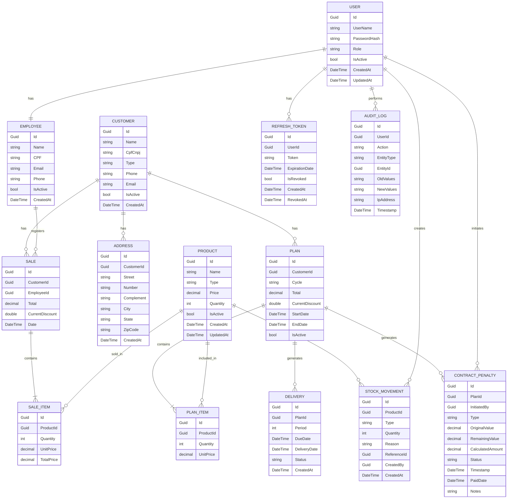

# Diagrama Entidade-Relacionamento (ERD) - AquaGás Distribuidora

Este documento contém o Diagrama Entidade-Relacionamento (ERD) baseado na arquitetura técnica e no Documento de Requisitos do Produto (DRP) do sistema AquaGás Distribuidora. O ERD foi gerado em Mermaid, seguindo os princípios de Domain-Driven Design (DDD) e Clean Architecture.

## Diagrama ER

## Legenda de Cardinalidade de Relacionamento
- `||--||`: Relacionamento 1:1 (exemplo: Herança Usuário-Funcionário).
- `||--o{`: Relacionamento 1:N (exemplo: Cliente possui múltiplas Vendas).
- `||--|{`: Relacionamento 1:N Obrigatório (exemplo: Venda contém Itens de Venda).
- Relacionamentos N:M são representados via entidades intermediárias (Sale_Item, Plan_Item).

## Notas
- Este ERD reflete a estrutura atual e sugerida com base nos documentos.
- As entidades são separadas por contextos/módulos para alinhamento com DDD.
- **Endereço (Address)**: Agora é uma entidade separada com relacionamento 1:N com Cliente, permitindo múltiplos endereços por cliente (principal, secundário, etc.).
- Sugestões de implementação: Adicionar Value Objects (VOs) como CPF, Telefone para encapsular validações.

---

## 📚 Documentação das Entidades

### 👤 USER (Módulo Auth)
**Propósito:** Entidade base para autenticação e controle de acesso do usuário

**Atributos:**
| Atributo | Tipo | Descrição |
|-----------|------|-------------|
| Id | Guid | Chave primária - identificador único |
| UserName | string | Nome de usuário para login (único) |
| PasswordHash | string | Senha criptografada (BCrypt) |
| Role | string | Papel do usuário (FUNCIONARIO, GESTOR) |
| IsActive | bool | Status de conta ativa |
| CreatedAt | DateTime | Timestamp de criação da conta |
| UpdatedAt | DateTime | Timestamp da última modificação |

**Relacionamentos:**
- 1:1 → EMPLOYEE (usuário possui um perfil de funcionário)
- 1:N → REFRESH_TOKEN (usuário possui múltiplos refresh tokens)
- 1:N → CONTRACT_PENALTY (gestor inicia multas)
- 1:N → AUDIT_LOG (usuário realiza ações de auditoria)
- 1:N → STOCK_MOVEMENT (usuário cria movimentações de estoque)

**Regras de Negócio (RN & RNF):**
- Apenas GESTOR pode excluir usuários e aplicar descontos (RF01)
- GESTOR não pode excluir a si mesmo (RF01)
- A senha deve ser criptografada com BCrypt (RNF01)
- O login deve ser registrado no AUDIT_LOG (RNF02)
- IsActive impede que usuários inativos acessem o sistema

---

### 👨‍💼 EMPLOYEE (Módulo Funcionário)
**Propósito:** Perfil do funcionário e informações de trabalho

**Atributos:**
| Atributo | Tipo | Descrição |
|-----------|------|-------------|
| Id | Guid | Chave primária - mesma do Usuário vinculado |
| Name | string | Nome completo do funcionário |
| CPF | string | CPF (único, obrigatório) |
| Email | string | Endereço de e-mail profissional |
| Phone | string | Telefone de contato |
| IsActive | bool | Status de emprego |
| CreatedAt | DateTime | Data de criação do registro do funcionário |

**Relacionamentos:**
- 1:1 ← USER (conta de usuário vinculada)
- 1:N → SALE (funcionário registra vendas)

**Regras de Negócio (RN & RNF):**
- CPF deve ser único (RF02, RN09)
- CPF e UserName não podem ser duplicados (RF02)
- Usado para rastrear qual funcionário registrou transações
- Apenas GESTOR pode modificar o papel do funcionário

**Módulo:** `src/Modules/Employee`

---

### 📦 PRODUCT (Módulo Produto)
**Propósito:** Catálogo de produtos e gestão de inventário

**Atributos:**
| Atributo | Tipo | Descrição |
|-----------|------|-------------|
| Id | Guid | Chave primária |
| Name | string | Nome do produto (único) |
| Type | string | Tipo/categoria do produto (Água/Gás) |
| Price | decimal | Preço de venda no varejo |
| Quantity | int | Quantidade atual em estoque |
| IsActive | bool | Produto disponível para venda |
| CreatedAt | DateTime | Data de criação do produto |
| UpdatedAt | DateTime | Última atualização de preço/detalhes |

**Relacionamentos:**
- 1:N → SALE_ITEM (incluído em vendas)
- 1:N → PLAN_ITEM (incluído em planos)
- 1:N → STOCK_MOVEMENT (rastreamento de inventário)

**Regras de Negócio (RN & RNF):**
- Nome deve ser único (RF03)
- Preço deve ser > 0 (RF03)
- Quantidade não pode ficar negativa (RF06, RN06)
- Cada alteração de estoque cria um STOCK_MOVEMENT (RN06)
- Produtos inativos são excluídos das consultas (RF03)

**Módulo:** `src/Modules/Product`

---

### 🏢 CUSTOMER (Módulo Cliente)
**Propósito:** Conta do cliente e gestão de contato

**Atributos:**
| Atributo | Tipo | Descrição |
|-----------|------|-------------|
| Id | Guid | Chave primária |
| Name | string | Nome da empresa/pessoa |
| CpfCnpj | string | CPF (PF) ou CNPJ (PJ) - único |
| Type | string | Tipo de cliente: PF (Física) ou PJ (Jurídica) |
| Phone | string | Contato telefônico principal |
| Email | string | Endereço de e-mail |
| IsActive | bool | Status da conta do cliente |
| CreatedAt | DateTime | Data de criação da conta |

**Relacionamentos:**
- 1:N → ADDRESS (múltiplos endereços por cliente)
- 1:N → SALE (histórico de compras)
- 1:N → PLAN (contratos de assinatura)

**Regras de Negócio (RN & RNF):**
- CPF/CNPJ deve ser único (RN09, RF02)
- O Tipo determina as regras de validação (PF vs PJ)
- Essencial para o rastreamento histórico (RF07)
- Não pode ser excluído, apenas inativado (RF02)

**Módulo:** `src/Modules/Customer`

---

### 🏠 ADDRESS (Módulo Cliente - Suporte)
**Propósito:** Localização do cliente e informações de entrega

**Atributos:**
| Atributo | Tipo | Descrição |
|-----------|------|-------------|
| Id | Guid | Chave primária |
| CustomerId | Guid | Chave estrangeira para CUSTOMER |
| Street | string | Nome da rua |
| Number | string | Número do endereço |
| Complement | string | Informações adicionais (apto, bloco) |
| City | string | Nome da cidade |
| State | string | Código do Estado/Província |
| ZipCode | string | Código postal (CEP) |
| CreatedAt | DateTime | Data de criação do endereço |

**Relacionamentos:**
- N:1 → CUSTOMER (endereço pertence ao cliente)

**Regras de Negócio (RN & RNF):**
- Suporte a múltiplos endereços por cliente (principal + secundário)
- Usado como local de destino da entrega (RF05, RN03)
- Imutável após a criação (conformidade de auditoria)
- Um endereço principal por cliente

---

### 💳 SALE (Módulo Vendas)
**Propósito:** Registro de transações de vendas individuais/avulsas

**Atributos:**
| Atributo | Tipo | Descrição |
|-----------|------|-------------|
| Id | Guid | Chave primária |
| CustomerId | Guid | Chave estrangeira para CUSTOMER (opcional para vendas de balcão) |
| EmployeeId | Guid | Chave estrangeira para o EMPLOYEE que registrou |
| Total | decimal | Valor total da venda (soma dos itens) |
| CurrentDiscount | double | Percentual de desconto aplicado |
| Date | DateTime | Data da transação de venda |

**Relacionamentos:**
- N:1 → EMPLOYEE (registrada por)
- N:1 → CUSTOMER (opcional, para vendas identificadas)
- 1:N → SALE_ITEM (contém itens)

**Regras de Negócio (RN & RNF):**
- Não pode ser concluída se houver estoque insuficiente (RF06)
- Deve ter pelo menos um SALE_ITEM
- Aplicação de desconto restrita ao GESTOR (RN07)
- O estoque diminui imediatamente após a venda (RN06)
- Todas as vendas devem ser registradas manualmente (RN03)

**Módulo:** `src/Modules/Sales`

---

### 🛒 SALE_ITEM (Módulo Vendas - Suporte)
**Propósito:** Itens individuais dentro de uma transação de venda

**Atributos:**
| Atributo | Tipo | Descrição |
|-----------|------|-------------|
| Id | Guid | Chave primária |
| ProductId | Guid | Chave estrangeira para PRODUCT |
| Quantity | int | Unidades vendidas |
| UnitPrice | decimal | Preço por unidade no momento da venda |
| TotalPrice | decimal | Quantidade × Preço Unitário |

**Relacionamentos:**
- N:1 → SALE (pertence à venda)
- N:1 → PRODUCT (produto vendido)

**Regras de Negócio (RN & RNF):**
- Quantidade deve ser > 0
- Preço Unitário capturado no momento da venda (RN04)
- Não pode ser modificado após a confirmação da venda
- Cada SALE_ITEM cria um STOCK_MOVEMENT (RN06)

---

### 📋 PLAN (Módulo Planos)
**Propósito:** Gestão de contratos de assinatura recorrente

**Atributos:**
| Atributo | Tipo | Descrição |
|-----------|------|-------------|
| Id | Guid | Chave primária |
| CustomerId | Guid | Chave estrangeira para CUSTOMER |
| Cycle | string | Ciclo de faturamento: MENSAL, TRIMESTRAL, ANUAL, PERSONALIZADO |
| Total | decimal | Valor total do contrato |
| CurrentDiscount | double | Percentual de desconto aplicado |
| StartDate | DateTime | Data de início do contrato |
| EndDate | DateTime | Data de término do contrato |
| IsActive | bool | Status ativo do contrato |

**Relacionamentos:**
- N:1 → CUSTOMER (pertence a)
- 1:N → PLAN_ITEM (contém itens)
- 1:N → DELIVERY (gera entregas)
- 1:N → CONTRACT_PENALTY (gera multas)

**Regras de Negócio (RN & RNF):**
- Totalmente customizável na criação (RN05)
- Gera registros de DELIVERY com base no ciclo (RF04)
- Upgrade sem multa (RN08)
- Downgrade/Cancelamento cria CONTRACT_PENALTY (RN08)
- Ciclos: Mensal, Trimestral, Anual, Períodos personalizados
- Não pode ser excluído, apenas cancelado (trilha de auditoria)

**Módulo:** `src/Modules/Plans`

---

### 📦 PLAN_ITEM (Módulo Planos - Suporte)
**Propósito:** Produtos incluídos em uma assinatura de plano

**Atributos:**
| Atributo | Tipo | Descrição |
|-----------|------|-------------|
| Id | Guid | Chave primária |
| ProductId | Guid | Chave estrangeira para PRODUCT |
| Quantity | int | Unidades por ciclo de entrega |
| UnitPrice | decimal | Preço de contrato por unidade |

**Relacionamentos:**
- N:1 → PLAN (pertence ao plano)
- N:1 → PRODUCT (produto incluído)

**Regras de Negócio (RN & RNF):**
- Quantidade deve ser > 0
- Preço Unitário é o preço de contrato negociado (RN04)
- Quantidade de entrega padrão para cada ciclo
- Imutável após a criação do plano (conformidade de auditoria)

---

### 🚚 DELIVERY (Módulo Planos - Suporte)
**Propósito:** Rastrear ciclos de entrega individuais de um plano recorrente

**Atributos:**
| Atributo | Tipo | Descrição |
|-----------|------|-------------|
| Id | Guid | Chave primária |
| PlanId | Guid | Chave estrangeira para PLAN |
| Period | int | Número do período de entrega (1, 2, 3...) |
| DueDate | DateTime | Data de entrega agendada |
| DeliveryDate | DateTime | Data de entrega real (anulável) |
| Status | string | PENDENTE, ENTREGUE, CANCELADO, ATRASADO |
| CreatedAt | DateTime | Data de criação do registro |

**Relacionamentos:**
- N:1 → PLAN (pertence a)

**Regras de Negócio (RN & RNF):**
- Criado automaticamente com base no ciclo do plano (RF04)
- Status: PENDENTE → ENTREGUE ou CANCELADO
- Status muda para ATRASADO se a DueDate passar
- A confirmação dispara um STOCK_MOVEMENT (RN06)
- Não pode ser modificado após a confirmação (imutabilidade)
- Rastreia a conformidade do plano e multas (RN08)

---

### ⚖️ CONTRACT_PENALTY (Módulo Planos - Suporte)
**Propósito:** Gerenciar multas por downgrades de plano e cancelamentos antecipados

**Atributos:**
| Atributo | Tipo | Descrição |
|-----------|------|-------------|
| Id | Guid | Chave primária |
| PlanId | Guid | Chave estrangeira para o PLAN afetado |
| InitiatedBy | Guid | Chave estrangeira para USER (apenas GESTOR) |
| Type | string | DOWNGRADE (10%), CANCELAMENTO_ANTECIPADO (15%), ENTREGA_ATRASADA, DANO |
| OriginalValue | decimal | Valor do plano quando a multa foi disparada |
| RemainingValue | decimal | Valor contratual remanescente |
| CalculatedAmount | decimal | Valor da multa calculado |
| Status | string | CALCULADO, PAGO, ISENTO, RECORRIDO |
| Timestamp | DateTime | Data de criação da multa |
| PaidDate | DateTime | Data do pagamento (anulável) |
| Notes | string | Informações adicionais ou justificativa |

**Relacionamentos:**
- N:1 → PLAN (pertence a)
- N:1 → USER (iniciado pelo gestor)

**Regras de Negócio (RN & RNF):**
- Criado automaticamente no downgrade do plano (10% do remanescente) (RN08)
- Criado automaticamente no cancelamento antecipado (15% do remanescente) (RN08)
- Apenas GESTOR pode criar/isentar multas (RBAC)
- Fluxo de status: CALCULADO → (PAGO | ISENTO | RECORRIDO)
- Imutável após a criação (conformidade de auditoria)
- Todas as alterações registradas no AUDIT_LOG (RNF02)
- Suporta futuros tipos de multa (ENTREGA_ATRASADA, DANO)

---

### 🔑 REFRESH_TOKEN (Módulo Auth - Suporte)
**Propósito:** Gestão segura de sessão e atualização de token

**Atributos:**
| Atributo | Tipo | Descrição |
|-----------|------|-------------|
| Id | Guid | Chave primária |
| UserId | Guid | Chave estrangeira para USER |
| Token | string | Refresh token criptografado |
| ExpirationDate | DateTime | Timestamp de expiração do token |
| IsRevoked | bool | Status de revogação |
| CreatedAt | DateTime | Data de criação do token |
| RevokedAt | DateTime | Data de revogação (anulável) |

**Relacionamentos:**
- N:1 → USER (pertence a)

**Regras de Negócio (RN & RNF):**
- O token deve ser criptografado (RNF01 - Segurança)
- Suporte a múltiplos tokens por usuário
- Logout revoga o token imediatamente
- Tokens expirados são rejeitados automaticamente
- Imutável após a revogação (segurança)

---

### 📊 STOCK_MOVEMENT (Módulo Produto - Suporte)
**Propósito:** Trilha de auditoria completa das transações de inventário

**Atributos:**
| Atributo | Tipo | Descrição |
|-----------|------|-------------|
| Id | Guid | Chave primária |
| ProductId | Guid | Chave estrangeira para PRODUCT |
| Type | string | ENTRADA (stock in), SAÍDA (stock out), AJUSTE |
| Quantity | int | Quantidade movimentada |
| Reason | string | VENDA, ENTREGA_PLANO, AJUSTE_MANUAL, DEVOLUÇÃO, PERDA |
| ReferenceId | Guid | Chave estrangeira para a entidade de origem (Venda, Entrega) |
| CreatedBy | Guid | Chave estrangeira para o USER que registrou |
| CreatedAt | DateTime | Timestamp da movimentação |

**Relacionamentos:**
- N:1 → PRODUCT (afeta)
- N:1 → USER (criado por)

**Regras de Negócio (RN & RNF):**
- Toda alteração de estoque DEVE criar um registro (RN06, RNF02)
- SAÍDA não pode resultar em estoque negativo (RF06)
- ReferenceId vincula à Venda, Entrega ou motivo de ajuste
- Imutável após a criação (trilha de auditoria)
- Crítico para conformidade e reconciliação de estoque

---

### 📋 AUDIT_LOG (Infraestrutura Compartilhada)
**Propósito:** Trilha de auditoria imutável para conformidade e segurança

**Atributos:**
| Atributo | Tipo | Descrição |
|-----------|------|-------------|
| Id | Guid | Chave primária |
| UserId | Guid | Chave estrangeira para o USER que realizou a ação |
| Action | string | LOGIN, LOGOUT, CRIAR, ATUALIZAR, EXCLUIR, DESCONTO_APLICADO, PLANO_CANCELADO |
| EntityType | string | USER, EMPLOYEE, CUSTOMER, PRODUCT, PLAN, DELIVERY, SALE, CONTRACT_PENALTY |
| EntityId | Guid | ID da entidade afetada |
| OldValues | string | JSON do estado anterior |
| NewValues | string | JSON do novo estado |
| IpAddress | string | IP do cliente para rastreamento de segurança |
| Timestamp | DateTime | Timestamp da ação |

**Relacionamentos:**
- N:1 → USER (realizado por)

**Regras de Negócio (RN & RNF):**
- TODAS as operações de CRIAR/ATUALIZAR/EXCLUIR registradas (RNF02)
- LOGIN/LOGOUT registrados por segurança (RNF02)
- DESCONTO_APLICADO registrado especialmente para ações de GESTOR
- Não pode ser modificado ou excluído (imutabilidade)
- IpAddress armazenado para forense
- Essencial para requisitos de conformidade e auditoria

---

## 🔄 Resumo dos Principais Relacionamentos

| De | Para | Cardinalidade | Tipo | Descrição |
|------|-----|-------------|------|-------------|
| USER | EMPLOYEE | 1:1 | possui | Usuário possui um perfil de funcionário |
| USER | REFRESH_TOKEN | 1:N | possui | Usuário pode ter múltiplas sessões |
| USER | CONTRACT_PENALTY | 1:N | inicia | Gestor cria multas |
| USER | AUDIT_LOG | 1:N | realiza | Todas as ações do usuário registradas |
| USER | STOCK_MOVEMENT | 1:N | cria | Usuário registra movimentações de estoque |
| EMPLOYEE | SALE | 1:N | registra | Funcionário registra vendas |
| CUSTOMER | SALE | 1:N | possui | Histórico de compras do cliente |
| CUSTOMER | PLAN | 1:N | possui | Contratos de assinatura do cliente |
| CUSTOMER | ADDRESS | 1:N | possui | Múltiplos endereços de entrega |
| PRODUCT | SALE_ITEM | 1:N | vendido_em | Produto em vendas |
| PRODUCT | PLAN_ITEM | 1:N | incluído_em | Produto em planos |
| PRODUCT | STOCK_MOVEMENT | 1:N | rastreado_em | Rastreamento de inventário |
| SALE | SALE_ITEM | 1:N | contém | Venda contém itens (obrigatório) |
| PLAN | PLAN_ITEM | 1:N | contém | Plano contém itens (obrigatório) |
| PLAN | DELIVERY | 1:N | gera | Plano cria ciclos de entrega |
| PLAN | CONTRACT_PENALTY | 1:N | gera | Plano pode disparar multas |
